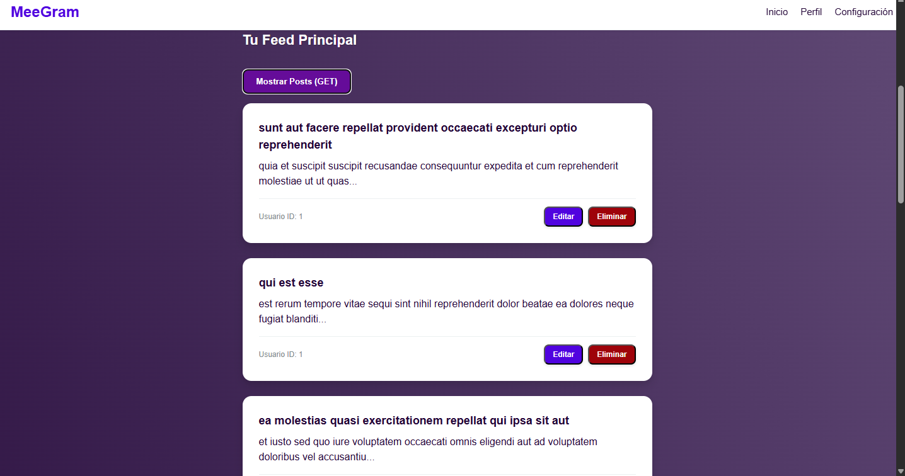
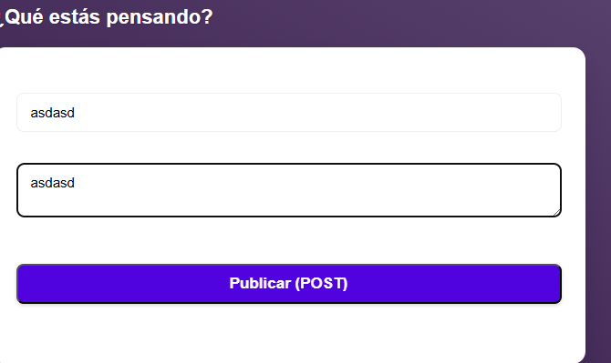
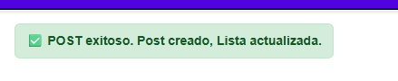
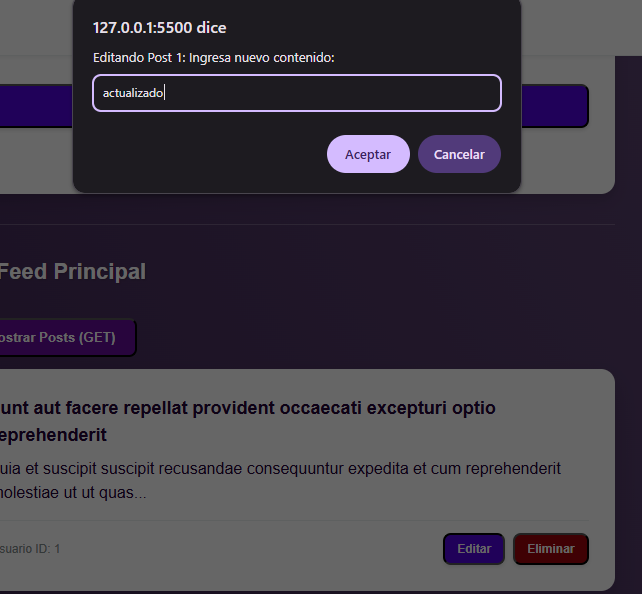
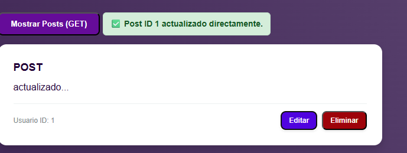
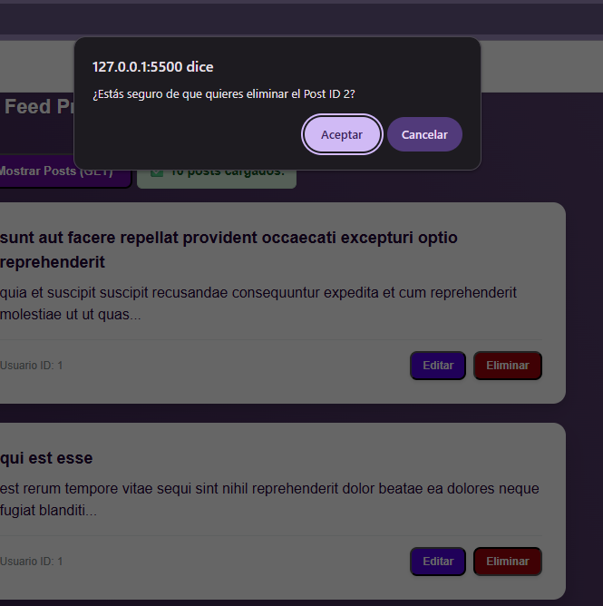

# 🚀 Consumo de API REST 
Interactúa con la API pública JSONPlaceholder para demostrar las operaciones CRUD (Crear, Leer, Actualizar, Eliminar) usando peticiones fetch.

## ⚙️ Estructura del Proyecto

Este proyecto aplica conceptos de comunicación cliente-servidor, manejo de promesas asíncronas y actualización del DOM para simular la gestión de recursos (`/posts`).

## 🌐 Endpoints y Métodos HTTP

Se utiliza la URL base de JSONPlaceholder y se manipulan recursos (`/posts`) siguiendo el estándar REST:

| Endpoint                                         | Método HTTP | Propósito                                                        |
| ------------------------------------------------ | ----------- | ---------------------------------------------------------------- |
| `https://jsonplaceholder.typicode.com/posts`     | GET         | Obtener y mostrar la lista inicial de posts.                     |
| `https://jsonplaceholder.typicode.com/posts`     | POST        | Crear un nuevo post desde el formulario de la interfaz.           |
| `https://jsonplaceholder.typicode.com/posts/{id}`| PUT         | Actualizar título y cuerpo de un post existente.                  |
| `https://jsonplaceholder.typicode.com/posts/{id}`| DELETE      | Eliminar un post específico.                                      |

## ✨ Características Clave

- **Renderizado de datos**: Los posts se muestran en una lista (`ul`) con un límite inicial de 10 elementos (filtrado localmente).
- **Manejo Asíncrono**: Uso de `async`/`await` y bloques `try`/`catch` para gestionar las peticiones.
- **Feedback Visual**: Mensajes de éxito (auto-eliminados tras 3 segundos) y error (permanentes) mediante la función `setStatus`.
- **Edición Directa**: Edición de posts mediante `prompt()`, con actualización inmediata en el DOM.

## 🖼️ Capturas de Pantalla

1. **Vista Inicial de Posts y Carga**
    

2. **Creación de un Nuevo Post (POST)**
    
    

3. **Edición de un Recurso (PUT)**
    
    
    

4. **Eliminación de un Recurso (DELETE)**
    
    ---

    > **Ejercicio realizado por Brisa Giavedoni para la clase 15 de Front End Avanzado en ADA ITW.**
